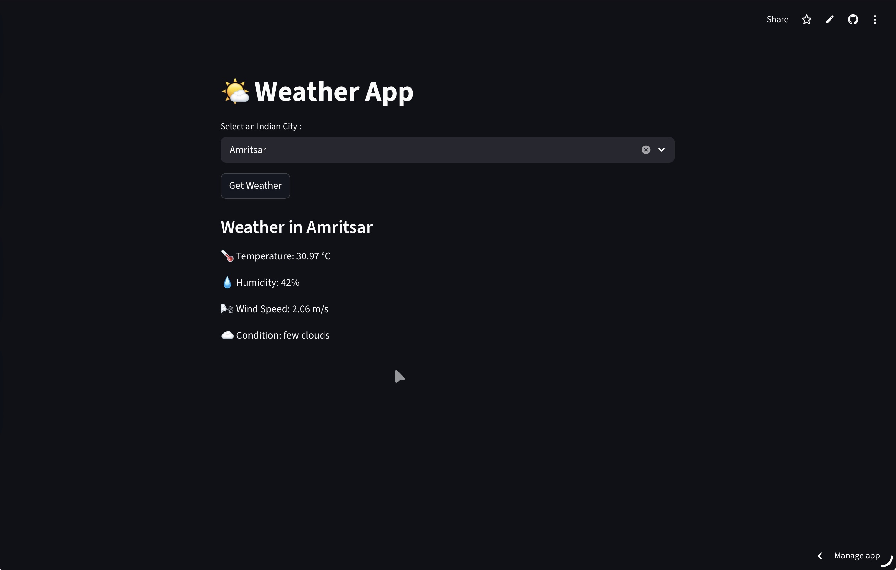

# Weatherapp
## Description
A streamlit frontend weather app using python requests. Using the Openweather.org api 2.5 call. \
URl : https://openweathermap.org/api/one-call-3?collection=one_call_api#concept

V.1 : The Basic Weather
- App shows
  - Temperature
  - Humidity
  - Conditions
  - Wind

